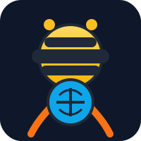

# Geoclaw Enterprise Edition v3.0 🐝🦷🌍

*Many claws, one hive mind.* Geoclaw Enterprise is a minimalist-but-powerful AI agent framework for Business Intelligence (BI) and Open Source Intelligence (OSINT). Agents (“bees”) run anywhere—from rugged tablets to cloud VMs—and weave their findings onto a shared map (the hive).



## Highlights
- **Autonomous skill runner:** drop-in Python skills auto-load and become callable tools.
- **Hive Mode:** multiple personas collaborate to pin intel on a geospatial canvas.
- **Edge friendly:** designed to run on low-power hardware with short setup time.
- **Textual dashboard:** `tui.py` provides a cross-platform console UI.

## Quick Start
1. **Install:**
   - macOS/Linux: `./install.sh`
   - Windows: Double-click `install.bat`
2. **Configure:** `python configure.py` (stores API keys in `.env`)
3. **Run:** `python tui.py` (Chat + Geo-Intel tabs)

## Deploy on Edge Devices
- Follow [`docs/edge-deploy.md`](docs/edge-deploy.md) for low-power tips.
- Example minimal boot:
  ```bash
  ./install.sh --minimal
  source .venv/bin/activate
  OPENAI_MODEL=gpt-4o-mini python main.py --skills-dir skills/forager
  ```
- Sync findings nightly with `rsync`/S3 and keep secrets in `.env`.

## Hive Mode & Personas
- Concept guide: [`docs/hive-mode.md`](docs/hive-mode.md)
- Sample persona: [`personas/forager.yaml`](personas/forager.yaml)
- Example workflow: [`workflows/hive-map-example.md`](workflows/hive-map-example.md)

## Skills
- Existing samples: `geo_analyst`, `osint_station`
- Add more via `skills/README.md`
- Idea starters: `map_normalize`, `memory_log`, `slack_alert`

## Roadmap Inspiration
- Slack/Discord connectors per persona
- Map visualization (Leaflet or Cesium) fed by hive NDJSON stream
- Memory subsystem for long-term org context
- Packaging as a zipapp for instant installs on kiosks

*Inspired by PicoClaw’s simplicity, tuned for enterprise hives. Contributions and forks welcome.*
